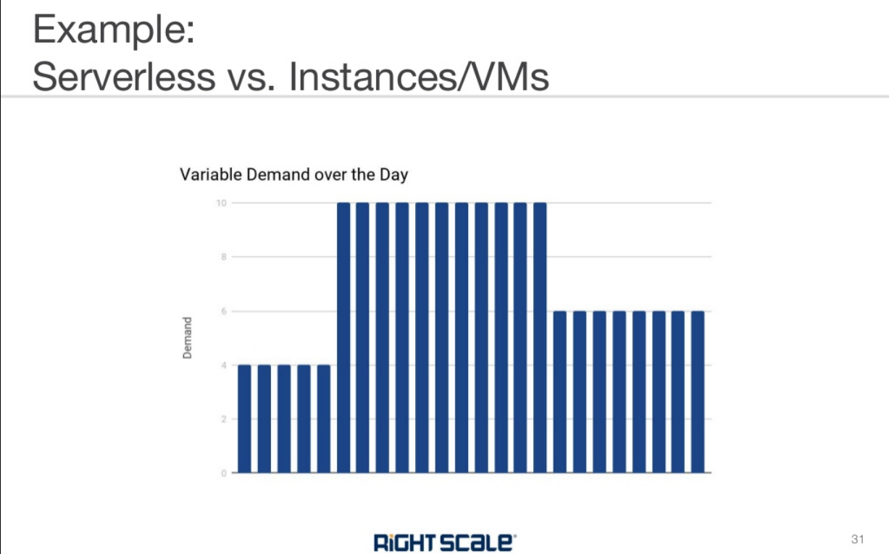

# alpha-beta

Serverless computing is a cloud computing execution model in which the cloud provider runs the server, and dynamically manages the allocation of machine resources. Pricing is based on the actual amount of resources consumed by an application, rather than on pre-purchased units of capacity.[1](https://techcrunch.com/2015/11/24/aws-lamda-makes-serverless-applications-a-reality/) It can be a form of utility computing. 

Serverless computing can simplify the process of deploying code into production. Scaling, capacity planning and maintenance operations may be hidden from the developer or operator. Serverless code can be used in conjunction with code deployed in traditional styles, such as microservices. Alternatively, applications can be written to be purely serverless and use no provisioned servers at all.[2](https://www.forbes.com/sites/janakirammsv/2015/07/16/paas-vendors-watch-out-amazon-is-all-set-to-disrupt-the-market/#72197a37e88d)

### Serverless runtimes

In 2008, Google released Google App Engine, which featured metered billing for applications that used a custom Python framework, but could not execute arbitrary code.[4](https://cloud.google.com/appengine/docs/standard/python/runtime?csw=1)

AWS Lambda, introduced by Amazon in 2014,[6](https://techcrunch.com/2014/11/13/amazon-launches-lambda-an-event-driven-compute-service/) was the first public cloud infrastructure vendor with an abstract serverless computing offering. It is supported by a number of additional AWS serverless tools such as AWS Serverless Application Model (AWS SAM) Amazon CloudWatch, and others.

Google Cloud Platform offers Google Cloud Functions since 2016.[7](https://venturebeat.com/2016/02/09/google-has-quietly-launched-its-answer-to-aws-lambda/)

Microsoft Azure offers Azure Functions, offered both in the Azure public cloud or on-premises via Azure Stack.[9](https://techcrunch.com/2016/03/31/microsoft-answers-aws-lambdas-event-triggered-serverless-apps-with-azure-functions/)

### Serverless databases

Several serverless databases have emerged in the last few years. These systems extend the serverless execution model to the RDBMS, eliminating the need to provision or scale virtualized or physical database hardware.

Amazon Aurora offers a serverless version of its databases, based on MySQL and PostgreSQL, providing on-demand, auto-scaling configurations. [10]

Azure Data Lake is a highly scalable data storage and analytics service. The service is hosted in Azure, Microsoft's public cloud. Azure Data Lake Analytics provides a distributed infrastructure that can dynamically allocate or de-allocate resources so customers pay for only the services they use.

Google Cloud Datastore is an eventually-consistent document store. It offers the database component of Google App Engine as a standalone service. Firebase, also owned by Google,[11] includes a hierarchical database and is available via fixed and pay-as-you-go plans.[12] 

### Advantages

#### Cost

Serverless can be more cost-effective than renting or purchasing a fixed quantity of servers,[13] which generally involves significant periods of underutilization or idle time.[1] It can even be more cost-efficient than provisioning an autoscaling group, due to more efficient bin-packing of the underlying machine resources.

This can be described as pay-as-you-go computing[13] or bare-code[13] as you are charged based solely upon the time and memory allocated to run your code; without associated fees for idle time.[13]

Immediate cost benefits are related to the lack of operating systems costs, including: licences, installation, dependencies, maintenance, support, and patching.[13]

#### Elasticity versus scalability

In addition, a serverless architecture means that developers and operators do not need to spend time setting up and tuning autoscaling policies or systems; the cloud provider is responsible for scaling the capacity to the demand.[1][9][13]. As Google puts it: ‘from prototype to production to planet-scale.’[13]

As cloud native systems inherently scale down as well as up, these systems are known as elastic rather than scalable.

Small teams of developers are able to run code themselves without the dependence upon teams of infrastructure and support engineers; more developers are becoming DevOps skilled and distinctions between being a software developer or hardware engineer are blurring.[13]

#### Productivity

With function as a service, the units of code exposed to the outside world are simple event driven functions. This means that typically, the programmer does not have to worry about multithreading or directly handling HTTP requests in their code, simplifying the task of back-end software development. 

### Disadvantages

#### Performance

Infrequently-used serverless code may suffer from greater response latency than code that is continuously running on a dedicated server, virtual machine, or container. This is because, unlike with autoscaling, the cloud provider typically "spins down" the serverless code completely when not in use. This means that if the runtime (for example, the Java runtime) requires a significant amount of time to start up, it will create additional latency.

#### Resource limits

Serverless computing is not suited to some computing workloads, such as high-performance computing, because of the resource limits imposed by cloud providers, and also because it would likely be cheaper to bulk-provision the number of servers believed to be required at any given point in time.

#### Monitoring and debugging

Diagnosing performance or excessive resource usage problems with serverless code may be more difficult than with traditional server code, because although entire functions can be timed,[2] there is typically no ability to dig into more detail by attaching profilers, debuggers or APM tools. Furthermore, the environment in which the code runs is typically not open source, so its performance characteristics cannot be precisely replicated in a local environment.

#### Security

Serverless is sometimes mistakenly considered as more secure than traditional architectures. While this is true to some extent because OS vulnerabilities are taken care of by the cloud provider, the total attack surface is significantly larger as there are many more components to the application compared to traditional architectures and each component is an entry point to the serverless application. Moreover, the security solutions customers used to have to protect their cloud workloads become irrelevant as customers cannot control and install anything on the endpoint and network level such as an intrusion detection/prevention system (IDS/IPS). [14]

This is intensified by the mono-culture properties of the entire server network. (A single flaw can be applied globally.) According to protego, the "solution to secure serverless apps is close partnership between developers, DevOps, and AppSec, also known as DevSecOps. Find the balance where developers don’t own security, but they aren’t absolved from responsibility either. Take steps to make it everyone’s problem. Create cross-functional teams and work towards tight integration between security specialists and development teams. Collaborate so your organization can resolve security risks at the speed of serverless."[15]

#### Privacy

Many serverless function environments are based on proprietary public cloud environments. Here, some privacy implications have to be considered, such as shared resources and access by external employees. However, serverless computing can also be done on private cloud environment or even on-premises, using for example the Kubernetes platform. This gives companies full control over privacy mechanisms, just as with hosting in traditional server setups.
Standards

Serverless computing is covered by International Data Center Authority (IDCA) in their Framework AE360. However, the part related to portability can be an issue when moving business logic from one public cloud to another for which the Docker solution was created. Cloud Native Computing Foundation (CNCF) is also working on developing a specification with Oracle.[16]

#### Vendor lock-in

Serverless computing is provided as a third-party service. Applications and software that run in the serverless environment are by default locked to a specific cloud vendor.[17] Therefore, serverless can cause multiple issues during migration.[18](https://squadex.com/insights/what-is-serverless/) 

### a overview

## amazon

[amazon](https://aws.amazon.com/serverless/)

## google

Google Cloud Functions，Google App Engine

[google](https://cloud.google.com/serverless)

### microsoft

Azure Data Lake Analytics提供类似Serverless的动态分配资源功能

[cloudflare](https://www.cloudflare.com/learning/serverless/what-is-serverless/)

[microsoft](https://azure.microsoft.com/en-us/overview/serverless-computing/)

#### Azure Security
By clicking the function URL and the GitHub Secret, we can collect the information needed to configure the WebHook in GitHub. As it is, the function is triggered by an action, to be decided, that is coming from our GitHub account. I am using my personal GitHub account to trigger this function 

### open source

开源FaaS的最初领导者之一是IBM（使用OpenWhisk，现在是一个Apache项目）。Microsoft，它开源了很多Azure功能平台。许多其他自托管FaaS实现使用底层容器平台，通常是Kubernetes，在这个领域，值得探索Galactic Fog，Fission和OpenFaaS等项目。在未来的博客中，我会重点关注OpenFaas项目，该项目目前有超过10k+的Star。

### start delay and cold start
FaaS平台在每个事件之前初始化函数实例需要一些时间。不同的函数，他的启动延迟也可能显着变化，从几毫秒到几秒的都有可能，取决于许多因素，具体一点以AWS Lambda为例。

Lambda函数的初始化即可以是“热启动”（使用Lambda函数的之前以前产生的容器），也可以是“冷启动”（创建新容器实例），冷启动带来的延迟应该引起了我们的关注。

冷启动的延迟取决于许多因素：开发语言，使用的库，代码量，Lambda函数环境本身的配置，是否需要连接到VPC资源等等。这些方面受开发人员的控制，通过这些地方的优化可以减少冷启动的一部分启动延迟。

可调的还有冷启动的启动频率。例如如果一个函数每秒处理10个事件，每个事件需要50毫秒来处理，那么每隔100,000-200,000个事件，您可能会看到一个实例的冷启动。另一方面，如果每小时处理一次事件，你可能会看到每个事件来时的冷启动，因为Amazon会在几分钟后退出非活动的Lambda实例。知道这一点有助于了解冷启动是否会影响集成效果，以及是否可能希望对函数实例执行“保持活动”以避免它们被回收。

冷启动需要太关注吗？这取决于应用程序的负载或流量的情况。如果你需要的是低延迟交易应用程序，那么最好忘掉FaaS系统吧，无论你使用哪一种编程语言。

无论你是否认为你的应用是否存在此类问题，你最好用类似生产的负载来测试性能。

- 和Paas平台相比
  
换句话说，大多数PaaS应用程序并不是为了响应事件而使整个应用程序启动或消失，而FaaS平台是。

FaaS和PaaS之间的关键运营差异是扩展。通常使用PaaS，你需要考虑如何扩展服务实例，使用FaaS应用程序，则是完全透明的。即使您将PaaS应用程序设置为自动扩展，你几乎不可能将此操作设置为单个请求的级别的扩展，举个例子，你一个服务实例，一般不会对不同的请求设置不同的实例数量，如果大量查询操作，和少量更新操作，你可能会考虑优化查询，增加缓存等，而不是在1分钟内，将你的实例扩大到100倍，因此FaaS应用程序在成本方面更加高效。

鉴于此优势，您为什么还要使用PaaS？也许最大的原因是工具成熟度，基于Paas有很多行之有效的实践，Faas给了我们系统扩展一些更多的思路。

- 和容器相比

另一种流行的服务抽象是容器，Docker是这种技术最明显的例子。Kubernetes之类的容器托管系统越来越受欢迎，它们从操作系统级部署中抽象出各个应用程序。在这条道路上，我们看到像Amazon ECS和EKS这样的云托管容器平台（这里推荐下，灵雀云的AKS发行版），以及Google Container Engine（Alauda Container Engine，AKE），它们像Serverless/FaaS一样，团队完全无需管理自己的服务器主机。鉴于容器发展的势头，还是值得考虑无服务器FaaS吗？

- 运维

无服务器并不意味着没有运维，它可能意味着没有系统管理员，运维比服务器管理重要，它至少还意味着：监控，部署，安全性，网络，以及通常一些生产调试和系统扩展。这些问题在无服务器应用程序中仍然存在，仍然需要一个策略来处理它们。在某些方面，Ops在无服务器世界中更难，因为很多都如此新鲜。无论哪种方式，在某些时候抽象可能会泄漏，你最好知道在某个地方，有一个人类系统管理员正在支持你的应用程序。

- 和存储过程的对比

另一个主题是无服务器FaaS是“存储过程即服务”。原文中也解释过了，但因为它实际上只是FaaS功能的一个子集，还有文章中提到的代码版本控制的问题，其他的几种开源方案不清楚，但是OpenFaas中有一个项目OpenFaas-Cloud，基于Github做了一个很棒的持续集成过程。

- 降低运营成本

无服务器是最简单的外包解决方案。你可以向云服务商付费以管理服务器，数据库甚至应用程序。基于规模经济效应：你为托管数据库支付的费用较少，因为一个供应商运行着数千个非常相似的数据库。
降低的成本来源于两方面，首先是纯粹来自与其他人共享基础设施（例如，硬件，网络）的基础设施成本。第二个是人工运维成本。

- 扩容成本
但在基础设施方面，最大的好处是您只需支付所需的计算费用，在AWS Lambda的情况下，AWS 为开发人员提供每月 100万的请求和 400,000 GB 的计算时间 ——无需任何费用，省去的可是真金白银！
    - 示例：低频的请求
假设正在运行仅每分钟处理一个请求的服务器应用程序，处理每个请求需要50毫秒，并且您在一小时内的平均CPU使用率为0.1％。如果将此应用程序部署到其自己的专用主机，那么这非常低效。这个机器你明明可以运行一千个类似的应用程序，共享在这台机器。
FaaS把降低的成本交给了你。使用上面的示例应用程序，每分钟只需支付50毫秒的计算费用。
    - 示例：不规律的流量洪峰
让我们看另一个例子。 假设你的服务收到的基准流量是每秒20个请求，但是每隔5分钟每秒会收到200个请求（通常数量的10倍），持续10秒。你当然不希望在流量峰值阶段减少响应时间。 你是如何解决这个问题的？

在传统环境中，你可能需要将总硬件数量增加10倍，仅仅为了处理峰值的情况，即使峰值的总持续时间不到总机器正常运行时间的4％。 ==自动扩展可能不是一个好的选择，因为新的实例启动时，服务器需要多长时间才能启动，峰值阶段将结束。==
> TODO: 难道Serverless computing就不是自动扩展的吗？

就像下图中的处理一样：
使用FaaS这就不会成为一个问题，只需在峰值阶段支付额外的计算费用就好。显然，这是一个Serverless/FaaS可以节省大量成本的示例，但重点是从扩展的角度来看。

- 优化是成本节约的根本
还有一个有趣的方面：对代码进行的任何性能优化不仅会提高应用程序的速度，而且还可以直接关系到运营成本的降低。例如你的FaaS函数，之前的相应需要100ms，进过优化后减少到50ms，那么恭喜，成本降低了一半，就是这么直接，不需要改任何基础架构。

运维管理的提升

扩容带来的便利
这个前文提到过多次，FaaS的扩展功能不仅降低了计算成本，而且还减少了操作管理，因为扩展是自动的。

在最好的情况下，如果扩展是手动的，那么运维人员需要明确地向一组服务器添加和删除实例 - 使用FaaS，忘记这一点并让FaaS供应商扩展你的应用程序。即使您已经在非FaaS架构中使用自动扩展，仍然需要设置和维护。 FaaS不再需要这项工作。

降低了打包和部署的复杂性

与部署整个服务器相比，打包和部署FaaS功能非常简单。 你所做的就是将所有代码打包到一个zip文件中，然后上传它，也没有决定是否在计算机上部署一个或多个容器。 如果您刚开始使用，甚至不需要打包任何东西 - 您可以在供应商控制台本身编写代码。OpenFaaS好玩了，它允许你直接拉取Github的源码，一个配置好CI参数后，一个Commit就会让你的函数更新掉。

这个过程不需要花费很长时间来描述，但对于某些团队而言，这种好处可能非常巨大：完全无服务器的解决方案需要零系统管理。

PaaS解决方案具有类似的部署优势，但正如我们之前看到的，在将PaaS与FaaS进行比较时，扩展优势是FaaS独有的。

交付速度和持续的验证

随着团队和产品越来越多地面向敏捷，我们希望不断尝试新事物并快速更新现有系统。虽然在持续交付的情况下进行简单的重新部署可以快速迭代稳定的项目，但是从具一个Idea到初始部署能力使我们能够以极快和低成本尝试新的实验。

前文提到的，基于FaaS的持续集成，非常完美的让你持续的实验下去。虽然成本效益是无服务器最容易表达的改进，但是这种缩短的交付时间让我最兴奋。它可以实现持续实验的产品开发思维，这是我们如何在公司中交付软件的真正革命。

- “绿色”计算？

在过去的几十年中，世界上数据中心的数量和规模都在大幅增加。除了建立这些中心所需的物理资源外，相关的能源需求如此之大，苹果，谷歌等都在谈论将一些数据中心托管在可再生能源附近以减少化石燃烧。

通电后的空闲，使得服务器消耗了大量的能量。

> Typical servers in business and enterprise data centers deliver between 5 and 15 percent of their maximum computing output on average over the course of the year. – Forbes

这非常低效，并产生巨大的环境影响。

一方面，云基础设施可能已经帮助减少了这种影响，因为公司可以按需“购买”更多的服务器，只有当他们绝对需要时，而不是提前很长时间配置所有可能必需的服务器。然而，人们还可以争辩说，如果没有足够的容量管理，很多服务器都会被丢弃，那么配置服务器的容易程度可能会使情况变得更糟。

无论我们使用自托管服务器，IaaS还是PaaS基础架构解决方案，我们仍然会手动制定关于我们的应用程序的容量决策，这些决策通常会持续数月或数年。通常，我们对管理容量持谨慎态度，因此我们过度配置，导致刚才描述的效率低下。使用无服务器方法，我们不再自己做出这样的容量决策 - 我们让FaaS供应商为我们的实时需求提供足够的计算容量。然后，供应商可以在其客户中汇总制定自己的容量决策，就像集中供暖，而不是你自己在北方的家里烧锅炉。

————————————————
版权声明：本文为CSDN博主「xialingming」的原创文章，遵循CC 4.0 BY-SA版权协议，转载请附上原文出处链接及本声明。
原文链接：https://blog.csdn.net/xialingming/java/article/details/81369624