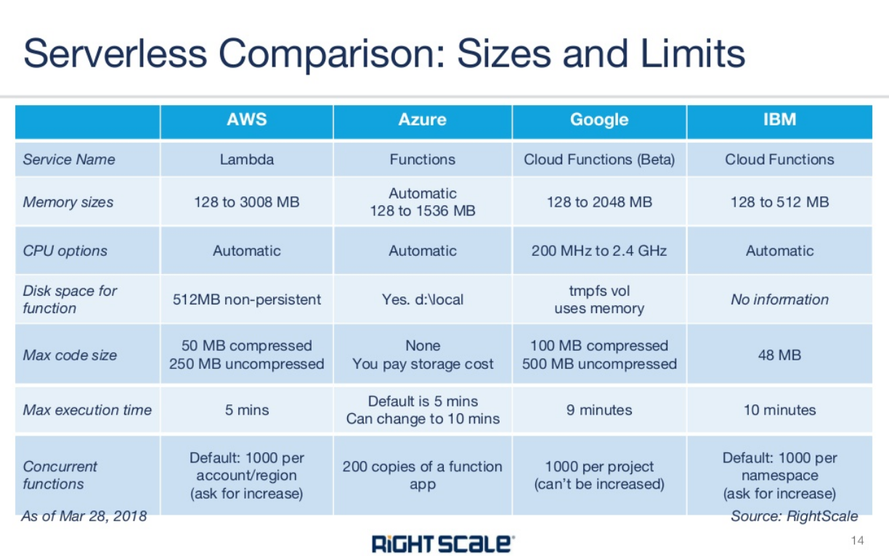
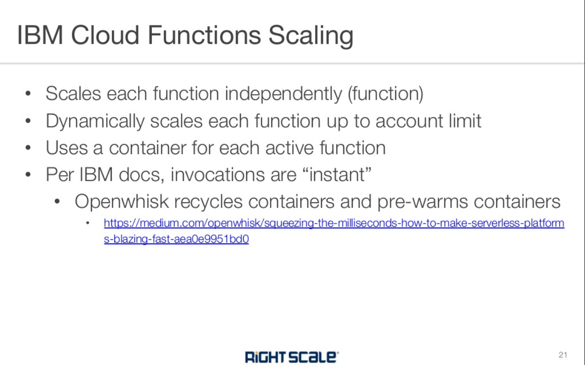
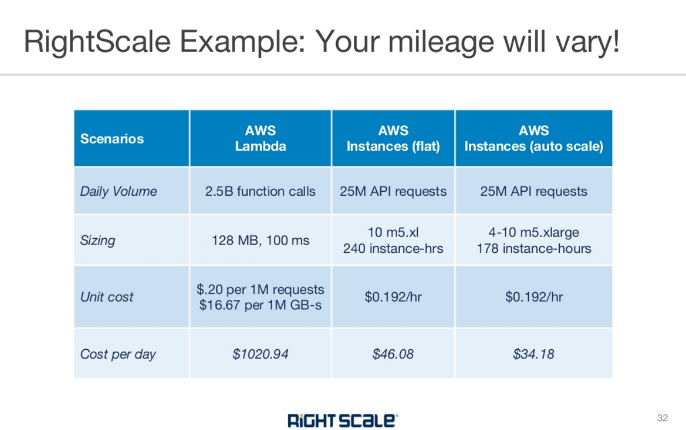

# alpha-beta

Serverless computing is a cloud computing execution model in which the cloud provider runs the server, and dynamically manages the allocation of machine resources. Pricing is based on the actual amount of resources consumed by an application, rather than on pre-purchased units of capacity.[1](https://techcrunch.com/2015/11/24/aws-lamda-makes-serverless-applications-a-reality/) It can be a form of utility computing. 

Serverless computing can simplify the process of deploying code into production. Scaling, capacity planning and maintenance operations may be hidden from the developer or operator. Serverless code can be used in conjunction with code deployed in traditional styles, such as microservices. Alternatively, applications can be written to be purely serverless and use no provisioned servers at all.[2](https://www.forbes.com/sites/janakirammsv/2015/07/16/paas-vendors-watch-out-amazon-is-all-set-to-disrupt-the-market/#72197a37e88d)

### Serverless runtimes

In 2008, Google released Google App Engine, which featured metered billing for applications that used a custom Python framework, but could not execute arbitrary code.[4](https://cloud.google.com/appengine/docs/standard/python/runtime?csw=1)

AWS Lambda, introduced by Amazon in 2014,[6](https://techcrunch.com/2014/11/13/amazon-launches-lambda-an-event-driven-compute-service/) was the first public cloud infrastructure vendor with an abstract serverless computing offering. It is supported by a number of additional AWS serverless tools such as AWS Serverless Application Model (AWS SAM) Amazon CloudWatch, and others.

Google Cloud Platform offers Google Cloud Functions since 2016.[7](https://venturebeat.com/2016/02/09/google-has-quietly-launched-its-answer-to-aws-lambda/)

Microsoft Azure offers Azure Functions, offered both in the Azure public cloud or on-premises via Azure Stack.[9](https://techcrunch.com/2016/03/31/microsoft-answers-aws-lambdas-event-triggered-serverless-apps-with-azure-functions/)

### Serverless databases

Several serverless databases have emerged in the last few years. These systems extend the serverless execution model to the RDBMS, eliminating the need to provision or scale virtualized or physical database hardware.

Amazon Aurora offers a serverless version of its databases, based on MySQL and PostgreSQL, providing on-demand, auto-scaling configurations. [10]

Azure Data Lake is a highly scalable data storage and analytics service. The service is hosted in Azure, Microsoft's public cloud. Azure Data Lake Analytics provides a distributed infrastructure that can dynamically allocate or de-allocate resources so customers pay for only the services they use.

Google Cloud Datastore is an eventually-consistent document store. It offers the database component of Google App Engine as a standalone service. Firebase, also owned by Google,[11] includes a hierarchical database and is available via fixed and pay-as-you-go plans.[12] 

### Advantages

#### Cost

Serverless can be more cost-effective than renting or purchasing a fixed quantity of servers,[13] which generally involves significant periods of underutilization or idle time.[1] It can even be more cost-efficient than provisioning an autoscaling group, due to more efficient bin-packing of the underlying machine resources.

This can be described as pay-as-you-go computing[13] or bare-code[13] as you are charged based solely upon the time and memory allocated to run your code; without associated fees for idle time.[13]

Immediate cost benefits are related to the lack of operating systems costs, including: licences, installation, dependencies, maintenance, support, and patching.[13]

#### Elasticity versus scalability

In addition, a serverless architecture means that developers and operators do not need to spend time setting up and tuning autoscaling policies or systems; the cloud provider is responsible for scaling the capacity to the demand.[1][9][13]. As Google puts it: ‘from prototype to production to planet-scale.’[13]

As cloud native systems inherently scale down as well as up, these systems are known as elastic rather than scalable.

Small teams of developers are able to run code themselves without the dependence upon teams of infrastructure and support engineers; more developers are becoming DevOps skilled and distinctions between being a software developer or hardware engineer are blurring.[13]

#### Productivity

With function as a service, the units of code exposed to the outside world are simple event driven functions. This means that typically, the programmer does not have to worry about multithreading or directly handling HTTP requests in their code, simplifying the task of back-end software development. 

### Disadvantages

#### Performance

Infrequently-used serverless code may suffer from greater response latency than code that is continuously running on a dedicated server, virtual machine, or container. This is because, unlike with autoscaling, the cloud provider typically "spins down" the serverless code completely when not in use. This means that if the runtime (for example, the Java runtime) requires a significant amount of time to start up, it will create additional latency.

#### Resource limits

Serverless computing is not suited to some computing workloads, such as high-performance computing, because of the resource limits imposed by cloud providers, and also because it would likely be cheaper to bulk-provision the number of servers believed to be required at any given point in time.

#### Monitoring and debugging

Diagnosing performance or excessive resource usage problems with serverless code may be more difficult than with traditional server code, because although entire functions can be timed,[2] there is typically no ability to dig into more detail by attaching profilers, debuggers or APM tools. Furthermore, the environment in which the code runs is typically not open source, so its performance characteristics cannot be precisely replicated in a local environment.

#### Security

Serverless is sometimes mistakenly considered as more secure than traditional architectures. While this is true to some extent because OS vulnerabilities are taken care of by the cloud provider, the total attack surface is significantly larger as there are many more components to the application compared to traditional architectures and each component is an entry point to the serverless application. Moreover, the security solutions customers used to have to protect their cloud workloads become irrelevant as customers cannot control and install anything on the endpoint and network level such as an intrusion detection/prevention system (IDS/IPS). [14]

This is intensified by the mono-culture properties of the entire server network. (A single flaw can be applied globally.) According to protego, the "solution to secure serverless apps is close partnership between developers, DevOps, and AppSec, also known as DevSecOps. Find the balance where developers don’t own security, but they aren’t absolved from responsibility either. Take steps to make it everyone’s problem. Create cross-functional teams and work towards tight integration between security specialists and development teams. Collaborate so your organization can resolve security risks at the speed of serverless."[15]

#### Privacy

Many serverless function environments are based on proprietary public cloud environments. Here, some privacy implications have to be considered, such as shared resources and access by external employees. However, serverless computing can also be done on private cloud environment or even on-premises, using for example the Kubernetes platform. This gives companies full control over privacy mechanisms, just as with hosting in traditional server setups.
Standards

Serverless computing is covered by International Data Center Authority (IDCA) in their Framework AE360. However, the part related to portability can be an issue when moving business logic from one public cloud to another for which the Docker solution was created. Cloud Native Computing Foundation (CNCF) is also working on developing a specification with Oracle.[16]

#### Vendor lock-in

Serverless computing is provided as a third-party service. Applications and software that run in the serverless environment are by default locked to a specific cloud vendor.[17] Therefore, serverless can cause multiple issues during migration.[18](https://squadex.com/insights/what-is-serverless/) 

### a overview

## amazon

[amazon](https://aws.amazon.com/serverless/)

## google

Google Cloud Functions，Google App Engine

[google](https://cloud.google.com/serverless)

### microsoft

Azure Data Lake Analytics提供类似Serverless的动态分配资源功能

[cloudflare](https://www.cloudflare.com/learning/serverless/what-is-serverless/)

[microsoft](https://azure.microsoft.com/en-us/overview/serverless-computing/)
