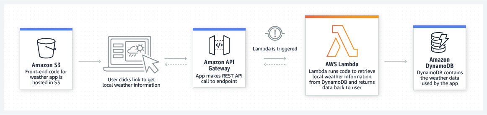

# amazon

Why use serverless?
--------
Building serverless applications means that your developers can focus on their core product instead of worrying about managing and operating servers or runtimes, either in the cloud or on-premises. This reduced overhead lets developers reclaim time and energy that can be spent on developing great products which scale and that are reliable.

AWS 无服务器平台
---------
AWS 可提供一系列完全托管的服务，您可以使用它们构建和运行无服务器应用程序。无服务器应用程序无需为后端组件（如计算、数据库、存储、流处理、消息排队等）预置、维护和管理服务器。此外，您再也无需担心应用程序的容错能力和可用性了。相反，AWS 会为您处理所有这些功能。这使您可以专注于产品创新，同时实现更快的上市时间。

## useful url

https://aws.amazon.com/serverless/

https://aws.amazon.com/serverless/serverlessrepo/

https://serverlessrepo.aws.amazon.com/applications

###  Serverless application use cases

Build virtually any type of application or backend service using a serverless architecture. Below are a couple of use cases:

Web applications and backends
-----------
You can build serverless web applications and backends using AWS Lambda, Amazon API Gateway, Amazon S3, and Amazon DynamoDB to handle web, mobile, Internet of Things (IoT), and chatbot requests.

Example: Weather application

Reference Architecture: [Github link](https://github.com/aws-samples/lambda-refarch-webapp)

Example: Mobile backend for social media app

Reference Architecture: [Github link](https://github.com/aws-samples/lambda-refarch-mobilebackend)

==Bustle runs a serverless backend for its Bustle iOS app and websites using AWS Lambda and Amazon API Gateway. Serverless architectures allow Bustle to never have to deal with infrastructure management, so every engineer can focus on building out new features and innovating.== [Read the case study](https://aws.amazon.com/solutions/case-studies/bustle/) 

> With AWS Lambda, we eliminate the need to worry about operations. We just write code, deploy it, and it scales infinitely; no one really has to deal with infrastructure management."

Data processing
--------------------
You can build a variety of real-time data processing systems using AWS Lambda, Amazon Kinesis, Amazon S3, and Amazon DynamoDB.

Example: Image Thumbnail Creation

Reference architecture: [Github link](https://github.com/aws-samples/lambda-refarch-fileprocessing)

==Square Enix uses AWS Lambda to run image processing for its massively multiplayer online game. With Lambda, it was able to reliably handle spikes of up to 30 times normal traffic. It also lowered the time required for image processing from several hours to just over 10 seconds, and it reduced infrastructure and operational costs.== [Read the case study](https://aws.amazon.com/solutions/case-studies/square-enix/)

Example: Analysis of streaming social media data

Reference architecture: [Github link](https://github.com/aws-samples/lambda-refarch-streamprocessing)

==Thomson Reuters uses a serverless architecture to process up to 4,000 events per second for its usage analytics service. The service reliably handles spikes of twice its normal traffic and has high durability. The company deployed the service into production in only five months using AWS.== [Read the case study](https://aws.amazon.com/solutions/case-studies/thomson-reuters/)

---------------------------
和serverless无关，但和我的专业有关，哈哈哈
[arm](https://aws.amazon.com/solutions/case-studies/arm-case-study/)