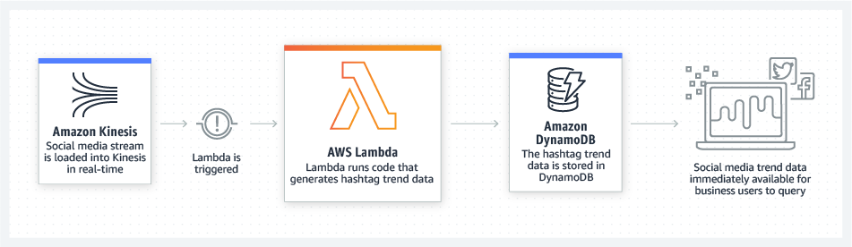
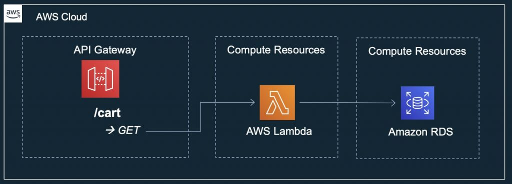

# amazon

Why use serverless?
--------
Building serverless applications means that your developers can focus on their core product instead of worrying about managing and operating servers or runtimes, either in the cloud or on-premises. This reduced overhead lets developers reclaim time and energy that can be spent on developing great products which scale and that are reliable.

The AWS serverless platform // AWS 无服务器平台
---------
AWS 可提供一系列完全托管的服务，您可以使用它们构建和运行无服务器应用程序。无服务器应用程序无需为后端组件（如计算、数据库、存储、流处理、消息排队等）预置、维护和管理服务器。此外，您再也无需担心应用程序的容错能力和可用性了。相反，AWS 会为您处理所有这些功能。这使您可以专注于产品创新，同时实现更快的上市时间。

AWS provides a set of fully managed services that you can use to build and run serverless applications. Serverless applications don’t require provisioning, maintaining, and administering servers for backend components such as compute, databases, storage, stream processing, message queueing, and more. You also no longer need to worry about ensuring application fault tolerance and availability. Instead, AWS handles all of these capabilities for you. This allows you to focus on product innovation while enjoying faster time-to-market.

## useful url

https://aws.amazon.com/serverless/

https://aws.amazon.com/serverless/serverlessrepo/

https://aws.amazon.com/lambda/

https://serverlessrepo.aws.amazon.com/applications

https://www.protego.io/serverless-observability-podcast/

https://www.protego.io/the-serverless-show-uc-berkeley-on-the-rise-of-serverless-computing/

https://www.hpcwire.com/2019/02/13/uc-berkeley-paper-heralds-rise-of-serverless-computing-in-the-cloud-do-you-agree/

https://jaxenter.com/3-experts-2019-microservices-153012.html

https://medium.com/zappos-engineering/lambda-architecture-in-aws-79c5fc06ca4a

https://aws.amazon.com/blogs/architecture/understanding-the-different-ways-to-invoke-lambda-functions/

https://aws.amazon.com/blogs/architecture/top-10-architecture-blog-posts-of-2019/

-----------------
###  Serverless application use cases

Build virtually any type of application or backend service using a serverless architecture. Below are a couple of use cases:

Web applications and backends
-----------
You can build serverless web applications and backends using AWS Lambda, Amazon API Gateway, Amazon S3, and Amazon DynamoDB to handle web, mobile, Internet of Things (IoT), and chatbot requests.

You can build serverless backends using AWS Lambda to handle web, mobile, Internet of Things (IoT), and 3rd party API requests. Take advantage of Lambda’s consistent performance controls, such as multiple memory configurations and Provisioned Concurrency, for building latency-sensitive applications at any scale.

Example: Weather application // Web applications

> By combining AWS Lambda with other AWS services, developers can build powerful web applications that automatically scale up and down and run in a highly available configuration across multiple data centers – with zero administrative effort required for scalability, back-ups or multi-data center redundancy.

Reference Architecture: [Github link](https://github.com/aws-samples/lambda-refarch-webapp)

Example: Mobile backend for social media app //Mobile backends

> AWS Lambda makes it easy to create rich, personalized app experiences. You can build backends using AWS Lambda and Amazon API Gateway to authenticate and process API requests. Use AWS Amplify to easily integrate your backend with your iOS, Android, Web, and React Native frontends.

Reference Architecture: [Github link](https://github.com/aws-samples/lambda-refarch-mobilebackend)

==Bustle runs a serverless backend for its Bustle iOS app and websites using AWS Lambda and Amazon API Gateway. Serverless architectures allow Bustle to never have to deal with infrastructure management, so every engineer can focus on building out new features and innovating.== [Read the case study](https://aws.amazon.com/solutions/case-studies/bustle/) 

> With AWS Lambda, we eliminate the need to worry about operations. We just write code, deploy it, and it scales infinitely; no one really has to deal with infrastructure management."

Example: IoT backends

> You can build serverless backends using AWS Lambda to handle web, mobile, Internet of Things (IoT), and 3rd party API requests.

Reference Architecture: [Github link](https://github.com/aws-samples/lambda-refarch-iotbackend)

Data processing
--------------------
You can build a variety of real-time data processing systems using AWS Lambda, Amazon Kinesis, Amazon S3, and Amazon DynamoDB.

You can use AWS Lambda to execute code ==in response to triggers such as changes in data==, shifts in system state, or actions by users. ==Lambda can be directly triggered by AWS services such as S3, DynamoDB, Kinesis, SNS, and CloudWatch, or it can be orchestrated into workflows by AWS Step Functions.== This allows you to build a variety of real-time serverless data processing systems.

Example: Image Thumbnail Creation // Real-time file processing

> You can use Amazon S3 to trigger AWS Lambda to process data immediately after an upload. For example, you can use Lambda to thumbnail images, transcode videos, index files, process logs, validate content, and aggregate and filter data in real-time.

Reference architecture: [Github link](https://github.com/aws-samples/lambda-refarch-fileprocessing)

==Square Enix uses AWS Lambda to run image processing for its massively multiplayer online game. With Lambda, it was able to reliably handle spikes of up to 30 times normal traffic. It also lowered the time required for image processing from several hours to just over 10 seconds, and it reduced infrastructure and operational costs.== [Read the case study](https://aws.amazon.com/solutions/case-studies/square-enix/)

Example: Analysis of streaming social media data // Real-time stream processing

> You can use AWS Lambda and Amazon Kinesis to process real-time streaming data for application activity tracking, transaction order processing, click stream analysis, data cleansing, metrics generation, log filtering, indexing, social media analysis, and IoT device data telemetry and metering.

Reference architecture: [Github link](https://github.com/aws-samples/lambda-refarch-streamprocessing)

==Thomson Reuters uses a serverless architecture to process up to 4,000 events per second for its usage analytics service. The service reliably handles spikes of twice its normal traffic and has high durability. The company deployed the service into production in only five months using AWS.== [Read the case study](https://aws.amazon.com/solutions/case-studies/thomson-reuters/)

Example: Extract, transform, load

> You can use AWS Lambda to perform data validation, filtering, sorting, or other transformations for every data change in a DynamoDB table and load the transformed data to another data store.

---------------------------
和serverless无关，但和我的专业有关，哈哈哈
[arm](https://aws.amazon.com/solutions/case-studies/arm-case-study/)

---------------------
## AWS Lambda

AWS Lambda lets you run code ==without provisioning or managing servers.== You pay only for the compute time you consume.

With Lambda, you can run code for virtually any type of application or backend service - all with zero administration. Just upload your code and ==Lambda takes care of everything required to run and scale your code with high availability==. **You can set up your code to automatically trigger from other AWS services or call it directly from any web or mobile app.**

Benefits:
- NO SERVERS TO MANAGE 
AWS Lambda automatically runs your code without requiring you to provision or manage servers. Just write the code and upload it to Lambda.
- CONTINUOUS SCALING 
AWS Lambda automatically scales your application by running code in response to each trigger. Your code runs in parallel and processes each trigger individually, scaling precisely with the size of the workload.
- SUBSECOND METERING
With AWS Lambda, you are charged for every 100ms your code executes and the number of times your code is triggered. You pay only for the compute time you consume. 
- CONSISTENT PERFORMANCE
With AWS Lambda, you can optimize your code execution time by choosing the right memory size for your function. You can also enable Provisioned Concurrency to keep your functions initialized and hyper-ready to respond within double digit milliseconds.

Asynchronous Invocation Settings Chapter: Invoking functions
----

Several AWS services, such as Amazon S3 and Amazon SNS, invoke functions asynchronously to process events. With new options in Lambda for asynchronous invocation, you can customize retry behavior. You can configure your function to send invocation records to a queue, topic, function, or event bus.

Concurrency Controls Chapter: Managing functions
----

Use concurrency controls in Lambda to ensure that your functions can scale up quickly without fluctuations in latency. Reserved concurrency splits the available concurrency in a Region into pools that are assigned to individual functions. A new control, provisioned concurrency, allocates concurrency before demand increases. Provisioned concurrency integrates with Application Auto Scaling to manage provisioned concurrency on a schedule or based on utilization.

Security in AWS Lambda
----
A new chapter on security provides an overview of cloud security concepts that are relevant to Lambda functions and applications. For details on Lambda features that support security best practices, see the Data Protection and Resilience topics.

## Top 10 Architecture Blog Posts of 2019

### #10: [How to Architect APIs for Scale and Security //  REST vs GraphQL APIs](https://aws.amazon.com/blogs/architecture/how-to-architect-apis-for-scale-and-security/)

This post was the first in a series that focused on best practices and concepts you should be familiar with when you architect APIs for your applications.

We’ll kick this first post off with a comparison between REST and ==GraphQL== API architectures.

Developers have been creating RESTful APIs for a long time, typically using HTTP methods, such as GET, POST, DELETE to perform operations against the API. Amazon API Gateway is designed to make it easy for developers to create APIs at any scale ==without managing any servers. API Gateway will handle all of the heavy lifting needed including traffic management, security, monitoring, and version/environment management.==

[Amazon API Gateway](https://aws.amazon.com/api-gateway/) 开发者不需要管理任何服务器。API Gateway能够处理所有的脏活累活，包括：交通流量管理、安全、监视、和版本环境的管理。

### #9: [From One to Many: Evolving VPC Guidance](https://aws.amazon.com/blogs/architecture/one-to-many-evolving-vpc-design/)

Since its inception, the ==Amazon Virtual Private Cloud (VPC)== has acted as the embodiment of security and privacy for customers who are looking to run their applications in a controlled, private, secure, and isolated environment.

### #8: [Things to Consider When You Build REST APIs with Amazon API Gateway](https://aws.amazon.com/blogs/architecture/things-to-consider-when-you-build-rest-apis-with-amazon-api-gateway/)

This post will dive deeper into the things an API architect or developer should consider when building REST APIs with Amazon API Gateway.

Request Rate (a.k.a. “TPS”)
Request rate is the first thing you should consider when designing REST APIs. By default, API Gateway allows for up to 10,000 requests per second. You should use the built in Amazon CloudWatch metrics to review how your API is being used. The Count metric in particular can help you review the total number of API requests in a given period.

It’s important to understand the actual request rate that your architecture is capable of supporting. For example, consider this architecture:

This API accepts GET requests to retrieve a user’s cart by using a Lambda function to perform SQL queries against a relational database managed in RDS.  If you receive a large burst of traffic, both API Gateway and Lambda will scale in response to the traffic. However, relational databases typically have limited memory/cpu capacity and will quickly exhaust the total number of connections.

As an API architect, you should design your APIs to protect your down stream applications.  You can start by defining API Keys and requiring your clients to deliver a key with incoming requests. This lets you track each application or client who is consuming your API.  This also lets you create Usage Plans and throttle your clients according to the plan you define.  For example, you if you know your architecture is capable of of sustaining 200 requests per second, you should define a Usage plan that sets a rate of 200 RPS and optionally configure a quota to allow a certain number of requests by day, week, or month.

Additionally, API Gateway lets you define throttling settings for the whole stage or per method. If you know that a GET operation is less resource intensive than a POST operation you can override the stage settings and set different throttling settings for each resource.

The example above describes a synchronous, tightly coupled architecture where the request must wait for a response from the backend integration (RDS in this case). This results in system scaling characteristics that are the lowest common denominator of all components. Instead, you should look for opportunities to design an asynchronous, loosely coupled architecture. A decoupled architecture separates the data ingestion from the data processing and allows you to scale each system separately. Consider this new architecture:

This architecture enables ingestion of orders directly into a highly scalable and durable data store such as ==Amazon Simple Queue Service (SQS)==.  Your backend can process these orders at any speed that is suitable for your business requirements and system ability.  Most importantly,  the health of the backend processing system does not impact your ability to continue accepting orders.

**Security**

Security with API Gateway falls into three major buckets, and I’ll outline them below. Remember, you should enable all three options to combine multiple layers of security.

- Option 1 (Application Firewall)
- Option 2 (Resource Policy)
- Option 3 (AuthZ)

很遗憾，为了工作量和篇幅，我们忽略这一部分。

==I hope you’ve enjoyed this post and our next post will cover GraphQL API architectures with AWS AppSync.==

### #7: [How to Design Your Serverless Apps for Massive Scale](https://aws.amazon.com/blogs/architecture/how-to-design-your-serverless-apps-for-massive-scale/)

**Scaling Considerations**

In general, developers in a “serverful” world need to be worried about how many total requests can be served throughout the day, week, or month, and how quickly their system can scale. As you move into the serverless world, the most important question you should understand becomes: “What is the concurrency that your system is designed to handle?”

The AWS Serverless platform allows you to scale very quickly in response to demand. Below is an example of a serverless design that is fully synchronous throughout the application. During periods of extremely high demand, Amazon API Gateway and AWS Lambda will scale in response to your incoming load. This design places extremely high load on your backend relational database because Lambda can easily scale from thousands to tens of thousands of concurrent requests. In most cases, your relational databases are not designed to accept the same number of concurrent connections.

==This design risks bottlenecks at your relational database and may cause service outages. This design also risks data loss due to throttling or database connection exhaustion.==

**Cloud Native Design**

Instead, you should consider decoupling your architecture and moving to an asynchronous model. In this architecture, you use an intermediary service to buffer incoming requests, such as Amazon Kinesis or Amazon Simple Queue Service (SQS). You can configure Kinesis or SQS as out of the box event sources for Lambda. In design below, AWS will automatically poll your Kinesis stream or SQS resource for new records and deliver them to your Lambda functions. You can control the batch size per delivery and further place throttles on a per Lambda function basis.

This design allows you to accept extremely high volume of requests, store the requests in a durable datastore, and process them at the speed which your system can handle.

**Conclusion**

Serverless computing allows you to scale much quicker than with server-based applications, but that means application architects should always consider the effects of scaling to your downstream services. Always keep in mind cost, speed, and reliability when you’re building your serverless applications.

### #3: [Understanding the Different Ways to Invoke Lambda Functions](https://aws.amazon.com/blogs/architecture/understanding-the-different-ways-to-invoke-lambda-functions/)

- Synchronous Invokes
- Asynchronous Invokes
- Poll-Based Invokes

### #1: [10 Things Serverless Architects Should Know](https://aws.amazon.com/blogs/architecture/ten-things-serverless-architects-should-know/)

1. API and Microservices Design
2. Event-driven Architectures and Asynchronous Messaging Patterns
3. Workflow Orchestration in a Distributed, Microservices Environment
4. Lambda Computing Environment and Programming Model
5. Serverless Deployment Automation and CI/CD Patterns
6. Serverless Identity Management, Authentication, and Authorization
7. End-to-End Security Techniques
8. Application Observability with Comprehensive Logging, Metrics, and Tracing
9. Ensuring Your Application is Well-Architected Continuing your Learning as Serverless Computing Continues to Evolve

## Specification

Each AWS Lambda instance is a container created from Amazon Linux AMIs (a Linux distribution related to RHEL) with 128-3008 MB of RAM (in 64 MB increments), 512 MB of ephemeral storage (available in /tmp, the data lasts only for the duration of the instance, it gets discarded after all the tasks running in the instance complete) and a configurable execution time from 1 to 900 seconds. The instances are neither started nor controlled directly. Instead, a package containing the required tasks has to be created and uploaded (usually) to an S3 bucket and AWS is instructed (via Amazon Kinesis, DynamoDB or SQS) to run it when an event is triggered. Each such execution is run in a new environment so access to the execution context of previous and subsequent runs is not possible. This essentially makes the instances stateless, all the incoming and outgoing data needs to be stored by external means (usually via S3 or DynamoDB, inbound connections to the instances is disabled). The maximum compressed size of a Lambda package is 50 MB with the maximum uncompressed size being 250 MB. 

----------
## other

摘要：2018年接近尾声，这一年，微软收购了Github，IBM收购了红帽，华为推出全栈专属FCS，Oracle努力从数据库身上寻求云业务的增长点。从现在看未来，这些行为预示着哪些市场变化呢？

本文整合了三位技术专家对于2019年技术发展的观点解读，涉及技术开发、人工智能、云计算等方面。不难看出，微服务的兴起可能会影响用户对数据库的需求，编码需求日益增长，无服务器将进入增长期，而Kubernetes将会在经过一段下降期后趋于稳定！

DataStax的 Developer Relations 副总裁 Patrick McFadin

1、微服务和容器将影响数据库的发展

用户正在使用微服务开发新应用程序以及完成工作所需的特定组件，所有组件都必须依赖数据运行。我们可以考虑将容器作为一个选择，运行可以随时间存储数据的有状态容器实例，相比之下，显然从数据库中可以获取更多数据。2019年，一个重要趋势是了解数据库如何满足应用程序的特定需求，更重要的是在不需要重写应用程序的前提下满足这些需求。

2、用户逐渐开始清晰认知Kubernetes

对于Kubernetes，之前可能存在许多炒作，它确实提供了一个大规模管理容器的好方法，但是用户很快就可以发现它的缺点。未来一年将会发生两件事情：一是在问题实际发生时，Kubernetes并没有很好满足过高期望，用户可能会开始产生抵触；二是用户开始对Kubernetes和容器产生清晰认知，意识到这并不能解决所有问题。

3、 在混合、多云世界中的企业需求

越来越多的企业希望推出混合和多云应用，但也必须考虑这其中存在的数据问题。2019年，人们不再仅关注应用程序组件而是考虑更广泛的应用程序基础架构。数据方面的问题将成为混合云、多云架构的一大难点，特别是如果想避免与某个云提供商绑定。

4、人工智能和机器学习对数据的影响

似乎，每个人、每家企业都想做人工智能。未来一年，云供应商将增加各种工具和集成以消除机器学习的复杂性。因此，更多实现建立在对云API服务的正确调用之上，而不是构建在算法和基础架构之上。

5、开源社区与云提供商的关系

2018年，云服务与开源项目之间的关系被进一步激化，明年应该可以看到开源基金会对此的回应以及云供应商在使用开源项目上的转变。通常作为回报，大型云提供商会加大对开源项目的贡献和推广力度。如果贡献力度下降，较小的开源项目将开始受到影响。

Sumo Logic联合创始人兼CTO Christian Beedgen

1、编程将成为一项更普及的技能

如今，自动化仍然是大规模成功的关键。随着云计算的崛起，开发人员将会发现新的实践点——敏捷，通过自动化实现敏捷，实时扩展需要自动化，扩缩容需要自动化…这些都需要程序员进行改进。

Sumo Logic产品营销总监 Benoton

1、无服务器将进入增长期，Kubernetes可能面临减速

Benoton 认为，无服务器将成为未来一年的主流，两类人非常适合应用无服务器：容器当前提供的计算无法满足需求的人和不想承担容器化开销的人。这种趋势始于2018年，其中AWS Lambda的采用率从2017年的24％增长到2018年的29％，预计这一数字将在2019年继续飙升。

容器化已接近炒作周期的顶端，很快就会陷入众所周知的幻灭低谷，但由于媒体的关注以及其提供托管或本地K8s服务，或将继续保持稳定。也就是说，随着越来越多的企业倾向于无服务器，容器的采用会在预期内有所下降。
————————————————
版权声明：本文为CSDN博主「weixin_34210740」的原创文章，遵循CC 4.0 BY-SA版权协议，转载请附上原文出处链接及本声明。
原文链接：https://blog.csdn.net/weixin_34210740/java/article/details/89179226