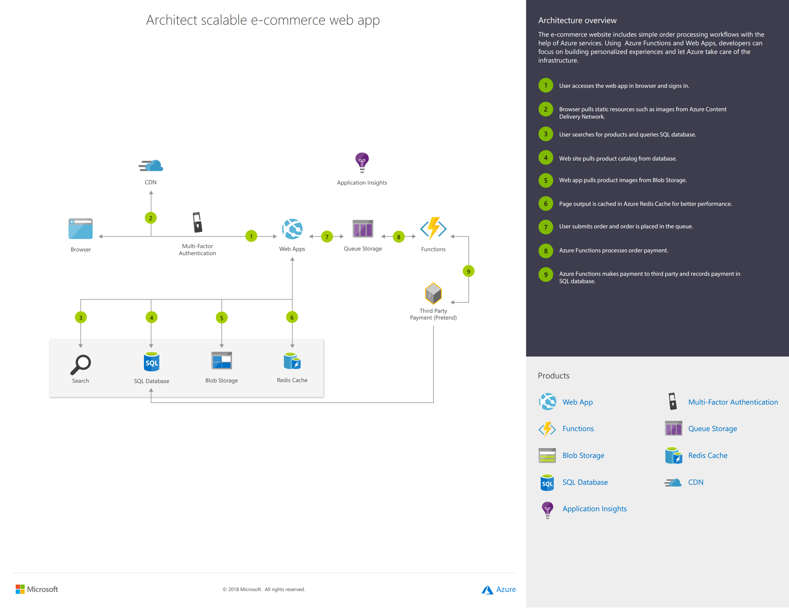

胡登杭 刘力玮
# Microsoft

## Benefits of serverless computing

### Increase developer velocity

* Reduce the time spent on tasks that are non-core to the business by freeing developers from infrastructure provisioning and management. Build and deploy faster using developer-friendly APIs, low-code/no-code services, and ready-to-use machine learning and cognitive models.

### Boost team performance

* Improve team agility and performance by using a fully managed platform to build, deploy, and operate applications. Build for any application pattern and environment—hybrid, cloud, and edge. Proactively manage applications with intelligent monitoring and analysis tools.

### Improve organizational impact

* Accelerate time to market with Azure serverless solutions that help your organization clear the path to innovation and new revenue opportunities. Reduce your infrastructure total cost of ownership and minimize risk with intelligent security management and advanced threat protection.

### No infrastructure management

* Using fully managed services enables developers to avoid administrative tasks and focus on core business logic. With a serverless platform, you simply deploy your code, and it runs with high availability.

### Dynamic scalability

* With serverless computing, the infrastructure dynamically scales up and down within seconds to match the demands of any workload.

### Faster time to market

* Serverless applications reduce the operations dependencies on each development cycle, increasing development teams’ agility to deliver more functionality in less time.

### More efficient use of resources

* Shifting to serverless technologies helps organizations reduce TCO and reallocate resources to accelerate the pace of innovation.

## Serverless application patterns

### Serverless functions

Serverless functions accelerate development by using an event-driven model, with triggers that automatically execute code to respond to events and bindings to seamlessly integrate additional services. A pay-per-execution model with sub-second billing charges only for the time and resources it takes to execute the code.

Azure Functions is an event driven, compute-on-demand experience that extends the existing Azure application platform with capabilities to implement code triggered by events occurring in virtually any Azure or 3rd party service as well as on-premises systems. Azure Functions allows developers to take action by connecting to data sources or messaging solutions, thus making it easy to process and react to events. Azure Functions scale based on demand and you pay only for the resources you consume.

Azure Functions allows you to run small pieces of code (called "functions") without worrying about application infrastructure. With Azure Functions, the cloud infrastructure provides all the up-to-date servers you need to keep your application running at scale.

A function is "triggered" by a specific type of event. Supported triggers include responding to changes in data, responding to messages, running on a schedule, or as the result of an HTTP request.

While you can always code directly against a myriad of services, integrating with other services is streamlined by using bindings. Bindings give you declarative access to a wide variety of Azure and third-party services.

#### Features
* `Serverless applications`: Functions allow you to develop serverless applications on Microsoft Azure.

* `Choice of language`: Write functions using your choice of C#, Java, JavaScript, Python, and PowerShell.

* `Pay-per-use pricing model`: Pay only for the time spent running your code. See the Consumption hosting plan option in the pricing section.

* `Bring your own dependencies`: Functions supports NuGet and NPM, giving you access to your favorite libraries.

* `Integrated security`: Protect HTTP-triggered functions with OAuth providers such as Azure Active Directory, Facebook, Google, Twitter, and Microsoft Account.

* `Simplified integration`: Easily integrate with Azure services and software-as-a-service (SaaS) offerings.

* `Flexible development`: Set up continuous integration and deploy your code through GitHub, Azure DevOps Services, and other supported development tools.

* `Stateful serverless architecture`: Orchestrate serverless applications with Durable Functions.

* `Open-source`: The Functions runtime is open-source and available on GitHub.

#### Do with Functions

Functions is a great solution for processing bulk data, integrating systems, working with the internet-of-things (IoT), and building simple APIs and micro-services.

* `HTTP`: Run code based on HTTP requests

* `Timer`: Schedule code to run at predefined times

* `Azure Cosmos DB`: Process new and modified Azure Cosmos DB documents

* `Blob storage`: Process new and modified Azure Storage blobs

* `Queue storage`: Respond to Azure Storage queue messages

* `Event Grid`: Respond to Azure Event Grid events via subscriptions and filters

* `Event Hub`: Respond to high-volumes of Azure Event Hub events

* `Service Bus Queue`: Connect to other Azure or on-premises services by responding Service Bus queue messages

* `Service Bus Topic`: Connect other Azure services or on-premises services by responding to Service Bus topic messages

#### Durable Functions

* Durable Functions is an extension of Azure Functions that lets you write stateful functions in a serverless compute environment. The extension lets you define stateful workflows by writing orchestrator functions and stateful entities by writing entity functions using the Azure Functions programming model. Behind the scenes, the extension manages state, checkpoints, and restarts for you, allowing you to focus on your business logic.

* The primary use case for Durable Functions is simplifying complex, stateful coordination requirements in serverless applications. The following sections describe typical application patterns that can benefit from Durable Functions:
    * Function chaining
    * Fan-out/fan-in
    * Async HTTP APIs
    * Monitoring
    * Human interaction
    * Aggregator (stateful entities)

* Behind the scenes, the Durable Functions extension is built on top of the Durable Task Framework, an open-source library on GitHub that's used to build workflows in code. Like Azure Functions is the serverless evolution of Azure WebJobs, Durable Functions is the serverless evolution of the Durable Task Framework. Microsoft and other organizations use the Durable Task Framework extensively to automate mission-critical processes. It's a natural fit for the serverless Azure Functions environment.

### Serverless Kubernetes

TODO

Developers bring their own containers to fully managed, Kubernetes-orchestrated clusters that can automatically scale up and down with sudden changes in traffic on spiky workloads.

### Serverless workflows

TODO

Serverless workflows take a low-code/no-code approach to simplify orchestration of combined tasks. Developers can integrate different services (either cloud or on-premises) without coding those interactions, having to maintain glue code, or learning new APIs or specifications.

### Serverless application environments

TODO

With a serverless application environment, both the back end and front end are hosted on fully managed services that handle scaling, security, and compliance requirements.

### Serverless API gateway

TODO

A serverless API gateway is a centralized, fully managed entry point for serverless backend services. It enables developers to publish, manage, secure, and analyze APIs at global scale.

## Serverless solution architectures

TODO

